```python
import pandas as pd
import numpy as np
import matplotlib.pyplot as plt
import seaborn as sns
```


```python
import warnings
warnings.filterwarnings('ignore')
```


```python
%matplotlib inline
plt.rcParams['font.sans-serif']=['SimHei']
```

# 任务分析
回归任务；

根据已有数据对房租进行预测；

评分=1-SSE/SST=SSR/SST，拟合效果越好，SSE越小，评分越高。

# 导入数据


```python
data_train = pd.read_csv('./数据集/train_data.csv')
data_train['Type'] = 'Train'
data_test = pd.read_csv('./数据集/test_a.csv')
data_test['Type'] = 'Test'
data_all = pd.concat([data_train, data_test], ignore_index=True)
```

# 基本信息探查


```python
data_train.info()
```

    <class 'pandas.core.frame.DataFrame'>
    RangeIndex: 41440 entries, 0 to 41439
    Data columns (total 52 columns):
    ID                    41440 non-null int64
    area                  41440 non-null float64
    rentType              41440 non-null object
    houseType             41440 non-null object
    houseFloor            41440 non-null object
    totalFloor            41440 non-null int64
    houseToward           41440 non-null object
    houseDecoration       41440 non-null object
    communityName         41440 non-null object
    city                  41440 non-null object
    region                41440 non-null object
    plate                 41440 non-null object
    buildYear             41440 non-null object
    saleSecHouseNum       41440 non-null int64
    subwayStationNum      41440 non-null int64
    busStationNum         41440 non-null int64
    interSchoolNum        41440 non-null int64
    schoolNum             41440 non-null int64
    privateSchoolNum      41440 non-null int64
    hospitalNum           41440 non-null int64
    drugStoreNum          41440 non-null int64
    gymNum                41440 non-null int64
    bankNum               41440 non-null int64
    shopNum               41440 non-null int64
    parkNum               41440 non-null int64
    mallNum               41440 non-null int64
    superMarketNum        41440 non-null int64
    totalTradeMoney       41440 non-null int64
    totalTradeArea        41440 non-null float64
    tradeMeanPrice        41440 non-null float64
    tradeSecNum           41440 non-null int64
    totalNewTradeMoney    41440 non-null int64
    totalNewTradeArea     41440 non-null int64
    tradeNewMeanPrice     41440 non-null float64
    tradeNewNum           41440 non-null int64
    remainNewNum          41440 non-null int64
    supplyNewNum          41440 non-null int64
    supplyLandNum         41440 non-null int64
    supplyLandArea        41440 non-null float64
    tradeLandNum          41440 non-null int64
    tradeLandArea         41440 non-null float64
    landTotalPrice        41440 non-null int64
    landMeanPrice         41440 non-null float64
    totalWorkers          41440 non-null int64
    newWorkers            41440 non-null int64
    residentPopulation    41440 non-null int64
    pv                    41422 non-null float64
    uv                    41422 non-null float64
    lookNum               41440 non-null int64
    tradeTime             41440 non-null object
    tradeMoney            41440 non-null float64
    Type                  41440 non-null object
    dtypes: float64(10), int64(30), object(12)
    memory usage: 16.4+ MB
    


```python
#描述统计信息
data_train.describe()
```


<div>
<style scoped>
    .dataframe tbody tr th:only-of-type {
        vertical-align: middle;
    }

    .dataframe tbody tr th {
        vertical-align: top;
    }

    .dataframe thead th {
        text-align: right;
    }
</style>
<table border="1" class="dataframe">
  <thead>
    <tr style="text-align: right;">
      <th></th>
      <th>ID</th>
      <th>area</th>
      <th>totalFloor</th>
      <th>saleSecHouseNum</th>
      <th>subwayStationNum</th>
      <th>busStationNum</th>
      <th>interSchoolNum</th>
      <th>schoolNum</th>
      <th>privateSchoolNum</th>
      <th>hospitalNum</th>
      <th>...</th>
      <th>tradeLandArea</th>
      <th>landTotalPrice</th>
      <th>landMeanPrice</th>
      <th>totalWorkers</th>
      <th>newWorkers</th>
      <th>residentPopulation</th>
      <th>pv</th>
      <th>uv</th>
      <th>lookNum</th>
      <th>tradeMoney</th>
    </tr>
  </thead>
  <tbody>
    <tr>
      <th>count</th>
      <td>4.144000e+04</td>
      <td>41440.000000</td>
      <td>41440.000000</td>
      <td>41440.000000</td>
      <td>41440.000000</td>
      <td>41440.000000</td>
      <td>41440.000000</td>
      <td>41440.000000</td>
      <td>41440.000000</td>
      <td>41440.000000</td>
      <td>...</td>
      <td>41440.000000</td>
      <td>4.144000e+04</td>
      <td>41440.000000</td>
      <td>41440.000000</td>
      <td>41440.000000</td>
      <td>41440.000000</td>
      <td>41422.000000</td>
      <td>41422.000000</td>
      <td>41440.000000</td>
      <td>4.144000e+04</td>
    </tr>
    <tr>
      <th>mean</th>
      <td>1.001221e+08</td>
      <td>70.959409</td>
      <td>11.413152</td>
      <td>1.338538</td>
      <td>5.741192</td>
      <td>187.197153</td>
      <td>1.506395</td>
      <td>48.228813</td>
      <td>6.271911</td>
      <td>4.308736</td>
      <td>...</td>
      <td>12621.406425</td>
      <td>1.045363e+08</td>
      <td>724.763918</td>
      <td>77250.235497</td>
      <td>1137.132095</td>
      <td>294514.059459</td>
      <td>26945.663512</td>
      <td>3089.077085</td>
      <td>0.396260</td>
      <td>8.837074e+03</td>
    </tr>
    <tr>
      <th>std</th>
      <td>9.376566e+04</td>
      <td>88.119569</td>
      <td>7.375203</td>
      <td>3.180349</td>
      <td>4.604929</td>
      <td>179.674625</td>
      <td>1.687631</td>
      <td>29.568448</td>
      <td>4.946457</td>
      <td>3.359714</td>
      <td>...</td>
      <td>49853.120341</td>
      <td>5.215216e+08</td>
      <td>3224.303831</td>
      <td>132052.508523</td>
      <td>7667.381627</td>
      <td>196745.147181</td>
      <td>32174.637924</td>
      <td>2954.706517</td>
      <td>1.653932</td>
      <td>5.514287e+05</td>
    </tr>
    <tr>
      <th>min</th>
      <td>1.000000e+08</td>
      <td>1.000000</td>
      <td>0.000000</td>
      <td>0.000000</td>
      <td>0.000000</td>
      <td>24.000000</td>
      <td>0.000000</td>
      <td>9.000000</td>
      <td>0.000000</td>
      <td>0.000000</td>
      <td>...</td>
      <td>0.000000</td>
      <td>0.000000e+00</td>
      <td>0.000000</td>
      <td>600.000000</td>
      <td>0.000000</td>
      <td>49330.000000</td>
      <td>17.000000</td>
      <td>6.000000</td>
      <td>0.000000</td>
      <td>0.000000e+00</td>
    </tr>
    <tr>
      <th>25%</th>
      <td>1.000470e+08</td>
      <td>42.607500</td>
      <td>6.000000</td>
      <td>0.000000</td>
      <td>2.000000</td>
      <td>74.000000</td>
      <td>0.000000</td>
      <td>24.000000</td>
      <td>2.000000</td>
      <td>1.000000</td>
      <td>...</td>
      <td>0.000000</td>
      <td>0.000000e+00</td>
      <td>0.000000</td>
      <td>13983.000000</td>
      <td>0.000000</td>
      <td>165293.000000</td>
      <td>7928.000000</td>
      <td>1053.000000</td>
      <td>0.000000</td>
      <td>2.800000e+03</td>
    </tr>
    <tr>
      <th>50%</th>
      <td>1.000960e+08</td>
      <td>65.000000</td>
      <td>7.000000</td>
      <td>0.000000</td>
      <td>5.000000</td>
      <td>128.000000</td>
      <td>1.000000</td>
      <td>47.000000</td>
      <td>5.000000</td>
      <td>4.000000</td>
      <td>...</td>
      <td>0.000000</td>
      <td>0.000000e+00</td>
      <td>0.000000</td>
      <td>38947.000000</td>
      <td>0.000000</td>
      <td>245872.000000</td>
      <td>20196.000000</td>
      <td>2375.000000</td>
      <td>0.000000</td>
      <td>4.000000e+03</td>
    </tr>
    <tr>
      <th>75%</th>
      <td>1.001902e+08</td>
      <td>90.000000</td>
      <td>16.000000</td>
      <td>1.000000</td>
      <td>7.000000</td>
      <td>258.000000</td>
      <td>3.000000</td>
      <td>61.000000</td>
      <td>9.000000</td>
      <td>6.000000</td>
      <td>...</td>
      <td>0.000000</td>
      <td>0.000000e+00</td>
      <td>0.000000</td>
      <td>76668.000000</td>
      <td>0.000000</td>
      <td>330610.000000</td>
      <td>34485.000000</td>
      <td>4233.000000</td>
      <td>0.000000</td>
      <td>5.500000e+03</td>
    </tr>
    <tr>
      <th>max</th>
      <td>1.003218e+08</td>
      <td>15055.000000</td>
      <td>88.000000</td>
      <td>52.000000</td>
      <td>22.000000</td>
      <td>824.000000</td>
      <td>8.000000</td>
      <td>142.000000</td>
      <td>24.000000</td>
      <td>14.000000</td>
      <td>...</td>
      <td>555508.010000</td>
      <td>6.197570e+09</td>
      <td>37513.062490</td>
      <td>855400.000000</td>
      <td>143700.000000</td>
      <td>928198.000000</td>
      <td>621864.000000</td>
      <td>39876.000000</td>
      <td>37.000000</td>
      <td>1.000000e+08</td>
    </tr>
  </tbody>
</table>
<p>8 rows × 40 columns</p>
</div>


```python
data_train.head(3)
```


<div>
<style scoped>
    .dataframe tbody tr th:only-of-type {
        vertical-align: middle;
    }

    .dataframe tbody tr th {
        vertical-align: top;
    }

    .dataframe thead th {
        text-align: right;
    }
</style>
<table border="1" class="dataframe">
  <thead>
    <tr style="text-align: right;">
      <th></th>
      <th>ID</th>
      <th>area</th>
      <th>rentType</th>
      <th>houseType</th>
      <th>houseFloor</th>
      <th>totalFloor</th>
      <th>houseToward</th>
      <th>houseDecoration</th>
      <th>communityName</th>
      <th>city</th>
      <th>...</th>
      <th>landMeanPrice</th>
      <th>totalWorkers</th>
      <th>newWorkers</th>
      <th>residentPopulation</th>
      <th>pv</th>
      <th>uv</th>
      <th>lookNum</th>
      <th>tradeTime</th>
      <th>tradeMoney</th>
      <th>Type</th>
    </tr>
  </thead>
  <tbody>
    <tr>
      <th>0</th>
      <td>100309852</td>
      <td>68.06</td>
      <td>未知方式</td>
      <td>2室1厅1卫</td>
      <td>低</td>
      <td>16</td>
      <td>暂无数据</td>
      <td>其他</td>
      <td>XQ00051</td>
      <td>SH</td>
      <td>...</td>
      <td>0.0</td>
      <td>28248</td>
      <td>614</td>
      <td>111546</td>
      <td>1124.0</td>
      <td>284.0</td>
      <td>0</td>
      <td>2018/11/28</td>
      <td>2000.0</td>
      <td>Train</td>
    </tr>
    <tr>
      <th>1</th>
      <td>100307942</td>
      <td>125.55</td>
      <td>未知方式</td>
      <td>3室2厅2卫</td>
      <td>中</td>
      <td>14</td>
      <td>暂无数据</td>
      <td>简装</td>
      <td>XQ00130</td>
      <td>SH</td>
      <td>...</td>
      <td>0.0</td>
      <td>14823</td>
      <td>148</td>
      <td>157552</td>
      <td>701.0</td>
      <td>22.0</td>
      <td>1</td>
      <td>2018/12/16</td>
      <td>2000.0</td>
      <td>Train</td>
    </tr>
    <tr>
      <th>2</th>
      <td>100307764</td>
      <td>132.00</td>
      <td>未知方式</td>
      <td>3室2厅2卫</td>
      <td>低</td>
      <td>32</td>
      <td>暂无数据</td>
      <td>其他</td>
      <td>XQ00179</td>
      <td>SH</td>
      <td>...</td>
      <td>0.0</td>
      <td>77645</td>
      <td>520</td>
      <td>131744</td>
      <td>57.0</td>
      <td>20.0</td>
      <td>1</td>
      <td>2018/12/22</td>
      <td>16000.0</td>
      <td>Train</td>
    </tr>
  </tbody>
</table>
<p>3 rows × 52 columns</p>
</div>


# 缺失值

pv,uv列缺失


```python
data_train.isna().any()
```


    ID                    False
    area                  False
    rentType              False
    houseType             False
    houseFloor            False
    totalFloor            False
    houseToward           False
    houseDecoration       False
    communityName         False
    city                  False
    region                False
    plate                 False
    buildYear             False
    saleSecHouseNum       False
    subwayStationNum      False
    busStationNum         False
    interSchoolNum        False
    schoolNum             False
    privateSchoolNum      False
    hospitalNum           False
    drugStoreNum          False
    gymNum                False
    bankNum               False
    shopNum               False
    parkNum               False
    mallNum               False
    superMarketNum        False
    totalTradeMoney       False
    totalTradeArea        False
    tradeMeanPrice        False
    tradeSecNum           False
    totalNewTradeMoney    False
    totalNewTradeArea     False
    tradeNewMeanPrice     False
    tradeNewNum           False
    remainNewNum          False
    supplyNewNum          False
    supplyLandNum         False
    supplyLandArea        False
    tradeLandNum          False
    tradeLandArea         False
    landTotalPrice        False
    landMeanPrice         False
    totalWorkers          False
    newWorkers            False
    residentPopulation    False
    pv                     True
    uv                     True
    lookNum               False
    tradeTime             False
    tradeMoney            False
    Type                  False
    dtype: bool


```python
data_train.info()
```

    <class 'pandas.core.frame.DataFrame'>
    RangeIndex: 41440 entries, 0 to 41439
    Data columns (total 52 columns):
    ID                    41440 non-null int64
    area                  41440 non-null float64
    rentType              41440 non-null object
    houseType             41440 non-null object
    houseFloor            41440 non-null object
    totalFloor            41440 non-null int64
    houseToward           41440 non-null object
    houseDecoration       41440 non-null object
    communityName         41440 non-null object
    city                  41440 non-null object
    region                41440 non-null object
    plate                 41440 non-null object
    buildYear             41440 non-null object
    saleSecHouseNum       41440 non-null int64
    subwayStationNum      41440 non-null int64
    busStationNum         41440 non-null int64
    interSchoolNum        41440 non-null int64
    schoolNum             41440 non-null int64
    privateSchoolNum      41440 non-null int64
    hospitalNum           41440 non-null int64
    drugStoreNum          41440 non-null int64
    gymNum                41440 non-null int64
    bankNum               41440 non-null int64
    shopNum               41440 non-null int64
    parkNum               41440 non-null int64
    mallNum               41440 non-null int64
    superMarketNum        41440 non-null int64
    totalTradeMoney       41440 non-null int64
    totalTradeArea        41440 non-null float64
    tradeMeanPrice        41440 non-null float64
    tradeSecNum           41440 non-null int64
    totalNewTradeMoney    41440 non-null int64
    totalNewTradeArea     41440 non-null int64
    tradeNewMeanPrice     41440 non-null float64
    tradeNewNum           41440 non-null int64
    remainNewNum          41440 non-null int64
    supplyNewNum          41440 non-null int64
    supplyLandNum         41440 non-null int64
    supplyLandArea        41440 non-null float64
    tradeLandNum          41440 non-null int64
    tradeLandArea         41440 non-null float64
    landTotalPrice        41440 non-null int64
    landMeanPrice         41440 non-null float64
    totalWorkers          41440 non-null int64
    newWorkers            41440 non-null int64
    residentPopulation    41440 non-null int64
    pv                    41422 non-null float64
    uv                    41422 non-null float64
    lookNum               41440 non-null int64
    tradeTime             41440 non-null object
    tradeMoney            41440 non-null float64
    Type                  41440 non-null object
    dtypes: float64(10), int64(30), object(12)
    memory usage: 16.4+ MB
    

# 特征值


```python
numeric_list=['area','totalFloor','saleSecHouseNum','subwayStationNum',
    'busStationNum','interSchoolNum','schoolNum','privateSchoolNum','hospitalNum',
    'drugStoreNum','gymNum','bankNum','shopNum','parkNum','mallNum','superMarketNum',
    'totalTradeMoney','totalTradeArea','tradeMeanPrice','tradeSecNum','totalNewTradeMoney',
    'totalNewTradeArea','tradeNewMeanPrice','tradeNewNum','remainNewNum','supplyNewNum',
    'supplyLandNum','supplyLandArea','tradeLandNum','tradeLandArea','landTotalPrice',
    'landMeanPrice','totalWorkers','newWorkers','residentPopulation','pv','uv','lookNum']

type_list=list(set(data_train.columns)-set(numeric_list)-set(['Type','ID','tradeTime']))
```

# 单调特征


```python
def incresing(vals):
    cnt = 0
    len_ = len(vals)
    for i in range(len_-1):
        if vals[i+1] > vals[i]:
            cnt += 1
    return cnt

for col in data_train.columns:
    cnt = incresing(data_train[col].values)
    if cnt / data_train.shape[0] >= 0.55:
        print('单调特征：',col)
        print('单调特征值个数：', cnt)
        print('单调特征值比例：', cnt / data_train.shape[0])
```

    单调特征： tradeTime
    单调特征值个数： 24085
    单调特征值比例： 0.5812017374517374
    

# 变量值分布


```python
for i in numeric_list:
    print(i)
    plt.hist(data_train[i],bins=20)
    plt.show()
```

    area
    


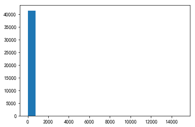


    totalFloor
    


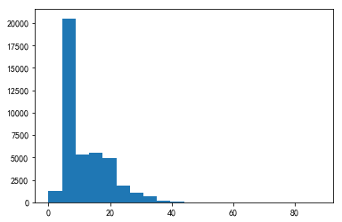


    saleSecHouseNum
    


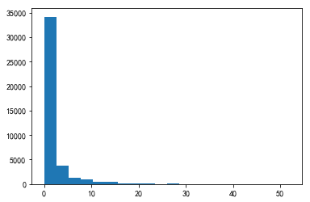


    subwayStationNum
    


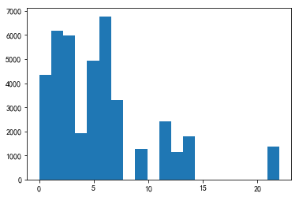


    busStationNum
    


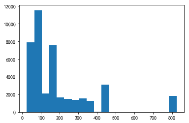


    interSchoolNum
    


    schoolNum
    


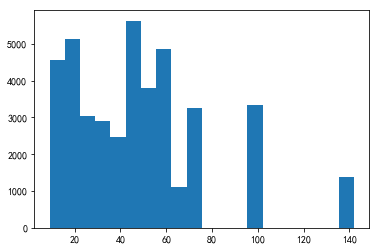


    privateSchoolNum
    


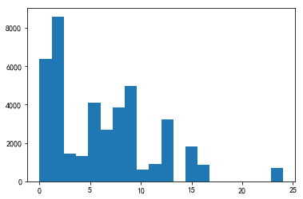


    hospitalNum
    


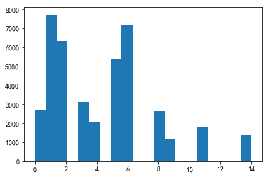


    drugStoreNum
    


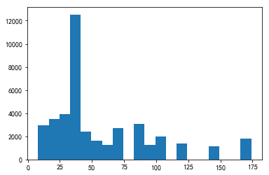


    gymNum
    


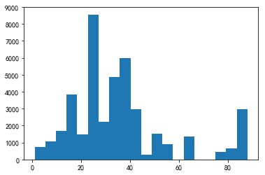


    bankNum
    


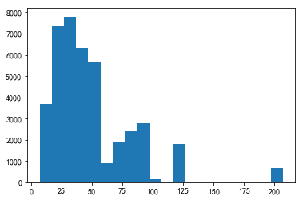


    shopNum
    


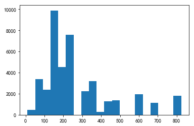


    parkNum
    


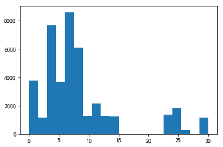


    mallNum
    


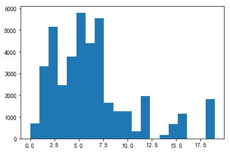


    superMarketNum
    


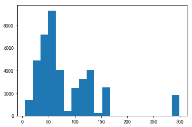


    totalTradeMoney
    


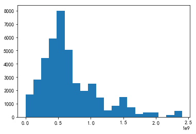


    totalTradeArea
    


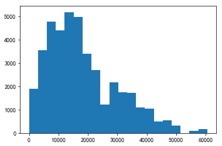


    tradeMeanPrice
    


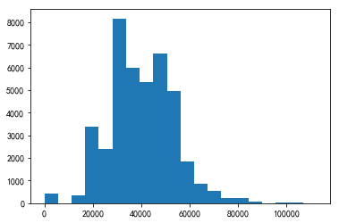


    tradeSecNum
    


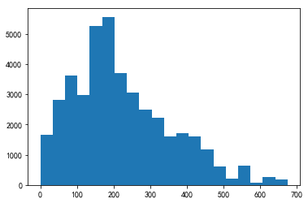


    totalNewTradeMoney
    


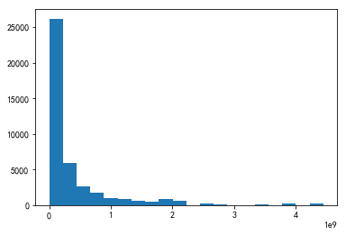


    totalNewTradeArea
    


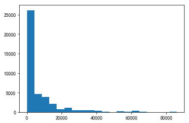


    tradeNewMeanPrice
    


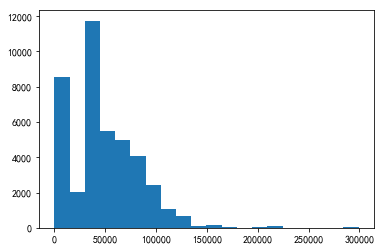


    tradeNewNum
    


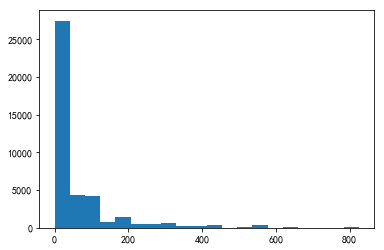


    remainNewNum
    


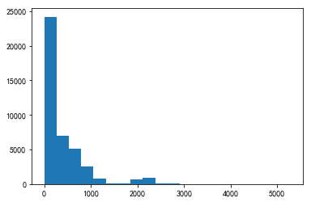


    supplyNewNum
    


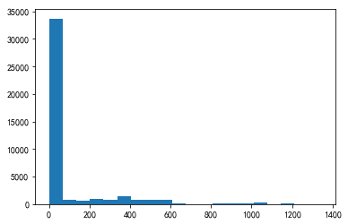


    supplyLandNum
    


    supplyLandArea
    


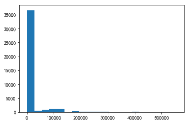


    tradeLandNum
    


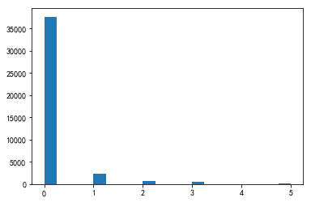


    tradeLandArea
    


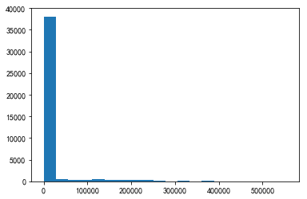


    landTotalPrice
    


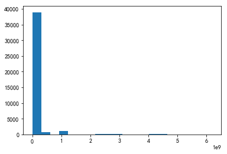


    landMeanPrice
    


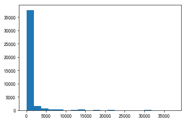


    totalWorkers
    


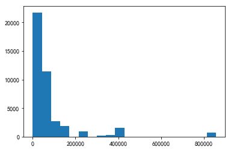


    newWorkers
    


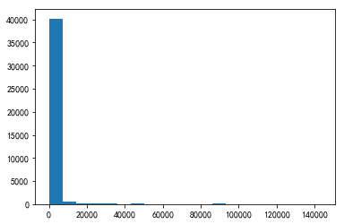


    residentPopulation
    


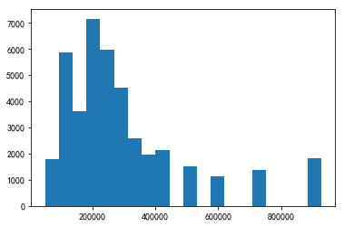


    pv
    


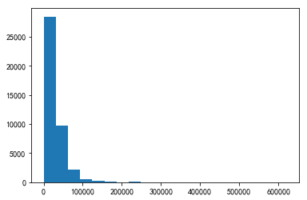


    uv
    


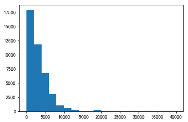


    lookNum
    


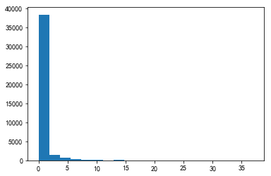


```python
for feature in type_list:
    print(feature + "的特征分布如下：")
    print(data_train[feature].value_counts())
```

    houseFloor的特征分布如下：
    中    15458
    高    14066
    低    11916
    Name: houseFloor, dtype: int64
    rentType的特征分布如下：
    未知方式    30759
    整租       5472
    合租       5204
    --          5
    Name: rentType, dtype: int64
    region的特征分布如下：
    RG00002    11437
    RG00005     5739
    RG00003     4186
    RG00010     3640
    RG00012     3368
    RG00004     3333
    RG00006     1961
    RG00007     1610
    RG00008     1250
    RG00013     1215
    RG00001     1157
    RG00014     1069
    RG00011      793
    RG00009      681
    RG00015        1
    Name: region, dtype: int64
    buildYear的特征分布如下：
    1994    2851
    暂无信息    2808
    2006    2007
    2007    1851
    2008    1849
    2005    1814
    2010    1774
    1995    1685
    1993    1543
    2011    1498
    2004    1431
    2009    1271
    2014    1238
    2003    1156
    1997    1125
    2002    1120
    2012    1049
    1996     991
    2000     925
    2001     898
    2015     840
    1999     822
    1998     733
    2013     714
    1987     632
    1983     612
    1991     545
    1984     493
    1980     452
    1990     431
            ... 
    1974      39
    1960      33
    1930      30
    1973      23
    1955      20
    1932      19
    2017      14
    1936      12
    1952      12
    1931      11
    1968      10
    1965       8
    1967       7
    1937       5
    1910       5
    1920       5
    1949       4
    1940       4
    1963       4
    1969       3
    1959       3
    1970       3
    1912       3
    1972       2
    1926       2
    1939       2
    1961       2
    1951       1
    1962       1
    1950       1
    Name: buildYear, Length: 80, dtype: int64
    communityName的特征分布如下：
    XQ01834    358
    XQ01274    192
    XQ02273    188
    XQ03110    185
    XQ02337    173
    XQ01389    166
    XQ01658    163
    XQ02789    152
    XQ00530    151
    XQ01561    151
    XQ01339    132
    XQ00826    122
    XQ01873    122
    XQ02296    121
    XQ01232    119
    XQ01401    118
    XQ02441    117
    XQ00196    115
    XQ02365    109
    XQ01207    109
    XQ01410    108
    XQ00852    105
    XQ02072    103
    XQ01672    103
    XQ01375     99
    XQ01634     99
    XQ01642     99
    XQ01970     96
    XQ00210     93
    XQ00424     92
              ... 
    XQ01474      1
    XQ03830      1
    XQ04039      1
    XQ00001      1
    XQ01818      1
    XQ02630      1
    XQ01944      1
    XQ03775      1
    XQ03262      1
    XQ00691      1
    XQ00319      1
    XQ03904      1
    XQ01288      1
    XQ00448      1
    XQ01939      1
    XQ00872      1
    XQ02411      1
    XQ01731      1
    XQ00993      1
    XQ04093      1
    XQ03673      1
    XQ03725      1
    XQ00866      1
    XQ00902      1
    XQ02212      1
    XQ01029      1
    XQ02620      1
    XQ02330      1
    XQ02699      1
    XQ02188      1
    Name: communityName, Length: 4236, dtype: int64
    plate的特征分布如下：
    BK00031    1958
    BK00033    1837
    BK00045    1816
    BK00055    1566
    BK00056    1516
    BK00052    1375
    BK00017    1305
    BK00041    1266
    BK00054    1256
    BK00051    1253
    BK00046    1227
    BK00035    1156
    BK00042    1137
    BK00009    1016
    BK00050     979
    BK00043     930
    BK00026     906
    BK00047     880
    BK00034     849
    BK00013     834
    BK00053     819
    BK00028     745
    BK00040     679
    BK00060     671
    BK00010     651
    BK00029     646
    BK00062     618
    BK00022     614
    BK00018     613
    BK00064     590
               ... 
    BK00037     444
    BK00012     412
    BK00038     398
    BK00024     397
    BK00020     384
    BK00002     357
    BK00065     348
    BK00027     344
    BK00039     343
    BK00063     281
    BK00057     278
    BK00015     253
    BK00006     231
    BK00021     226
    BK00007     225
    BK00030     219
    BK00066     219
    BK00049     211
    BK00008     210
    BK00004     189
    BK00048     165
    BK00025     157
    BK00023     127
    BK00059     122
    BK00044      98
    BK00016      40
    BK00036      33
    BK00058      15
    BK00032       3
    BK00001       1
    Name: plate, Length: 66, dtype: int64
    houseDecoration的特征分布如下：
    其他    29040
    精装    10918
    简装     1171
    毛坯      311
    Name: houseDecoration, dtype: int64
    city的特征分布如下：
    SH    41440
    Name: city, dtype: int64
    houseType的特征分布如下：
    1室1厅1卫    9805
    2室1厅1卫    8512
    2室2厅1卫    6783
    3室1厅1卫    3992
    3室2厅2卫    2737
    4室1厅1卫    1957
    3室2厅1卫    1920
    1室0厅1卫    1286
    1室2厅1卫     933
    2室2厅2卫     881
    4室2厅2卫     435
    2室0厅1卫     419
    4室2厅3卫     273
    5室1厅1卫     197
    2室1厅2卫     155
    3室2厅3卫     149
    3室1厅2卫     135
    1室0厅0卫      86
    6室1厅1卫      65
    4室2厅4卫      62
    5室2厅3卫      54
    4室2厅1卫      40
    1室1厅2卫      39
    4室3厅3卫      34
    4室3厅4卫      34
    5室2厅2卫      33
    5室2厅4卫      30
    5室3厅3卫      30
    4室1厅2卫      20
    5室3厅4卫      20
              ... 
    9室3厅8卫       1
    7室4厅3卫       1
    0室0厅1卫       1
    3室1厅0卫       1
    4室4厅2卫       1
    6室4厅2卫       1
    6室4厅5卫       1
    5室5厅4卫       1
    7室1厅3卫       1
    4室1厅4卫       1
    6室2厅6卫       1
    6室4厅4卫       1
    7室3厅4卫       1
    8室4厅4卫       1
    2室1厅3卫       1
    3室4厅4卫       1
    7室1厅7卫       1
    3室0厅0卫       1
    4室0厅2卫       1
    3室2厅5卫       1
    6室1厅4卫       1
    8室3厅4卫       1
    9室2厅5卫       1
    6室2厅5卫       1
    8室2厅3卫       1
    5室2厅6卫       1
    8室2厅4卫       1
    5室4厅2卫       1
    5室1厅3卫       1
    5室1厅5卫       1
    Name: houseType, Length: 104, dtype: int64
    houseToward的特征分布如下：
    南       34377
    南北       2254
    北        2043
    暂无数据      963
    东南        655
    东         552
    西         264
    西南        250
    西北         58
    东西         24
    Name: houseToward, dtype: int64
    tradeMoney的特征分布如下：
    4000.00        1450
    3500.00        1345
    4500.00        1222
    3000.00        1209
    5000.00        1165
    3800.00        1083
    3600.00         889
    4300.00         863
    4200.00         838
    3300.00         834
    4800.00         763
    3200.00         758
    6000.00         740
    2800.00         719
    5500.00         694
    3400.00         605
    3700.00         596
    2500.00         554
    4600.00         546
    6500.00         494
    5200.00         483
    2000.00         472
    3900.00         470
    2600.00         463
    5300.00         447
    4100.00         428
    3100.00         420
    5800.00         404
    7000.00         395
    8000.00         365
                   ... 
    980.00            1
    200.00            1
    34063.00          1
    5282.00           1
    99999999.99       1
    9150.00           1
    8846.00           1
    9885.00           1
    1620.00           1
    370000.00         1
    24800.00          1
    1370.00           1
    125000.00         1
    4920.00           1
    5477.00           1
    87600.00          1
    4232.00           1
    2376.00           1
    350.00            1
    1880.00           1
    3720.00           1
    350000.00         1
    15300.00          1
    3077.00           1
    3780.00           1
    23600.00          1
    3666.00           1
    13999.00          1
    23900.00          1
    1225.00           1
    Name: tradeMoney, Length: 836, dtype: int64
    

# 统计特征值出现频次大于100的特征


```python
for feature in type_list:
    df_value_counts = pd.DataFrame(data_train[feature].value_counts())
    df_value_counts = df_value_counts.reset_index()
    df_value_counts.columns = [feature, 'counts'] # change column names
    print(df_value_counts[df_value_counts['counts'] >= 100])
```

      houseFloor  counts
    0          中   15458
    1          高   14066
    2          低   11916
      rentType  counts
    0     未知方式   30759
    1       整租    5472
    2       合租    5204
         region  counts
    0   RG00002   11437
    1   RG00005    5739
    2   RG00003    4186
    3   RG00010    3640
    4   RG00012    3368
    5   RG00004    3333
    6   RG00006    1961
    7   RG00007    1610
    8   RG00008    1250
    9   RG00013    1215
    10  RG00001    1157
    11  RG00014    1069
    12  RG00011     793
    13  RG00009     681
       buildYear  counts
    0       1994    2851
    1       暂无信息    2808
    2       2006    2007
    3       2007    1851
    4       2008    1849
    5       2005    1814
    6       2010    1774
    7       1995    1685
    8       1993    1543
    9       2011    1498
    10      2004    1431
    11      2009    1271
    12      2014    1238
    13      2003    1156
    14      1997    1125
    15      2002    1120
    16      2012    1049
    17      1996     991
    18      2000     925
    19      2001     898
    20      2015     840
    21      1999     822
    22      1998     733
    23      2013     714
    24      1987     632
    25      1983     612
    26      1991     545
    27      1984     493
    28      1980     452
    29      1990     431
    30      1988     423
    31      1989     419
    32      1985     359
    33      1982     344
    34      1986     320
    35      1992     308
    36      1976     251
    37      1957     227
    38      1981     221
    39      1956     153
    40      1977     153
    41      2016     140
    42      1978     133
    43      1958     122
    44      1979     116
    45      1954     101
       communityName  counts
    0        XQ01834     358
    1        XQ01274     192
    2        XQ02273     188
    3        XQ03110     185
    4        XQ02337     173
    5        XQ01389     166
    6        XQ01658     163
    7        XQ02789     152
    8        XQ00530     151
    9        XQ01561     151
    10       XQ01339     132
    11       XQ00826     122
    12       XQ01873     122
    13       XQ02296     121
    14       XQ01232     119
    15       XQ01401     118
    16       XQ02441     117
    17       XQ00196     115
    18       XQ02365     109
    19       XQ01207     109
    20       XQ01410     108
    21       XQ00852     105
    22       XQ02072     103
    23       XQ01672     103
          plate  counts
    0   BK00031    1958
    1   BK00033    1837
    2   BK00045    1816
    3   BK00055    1566
    4   BK00056    1516
    5   BK00052    1375
    6   BK00017    1305
    7   BK00041    1266
    8   BK00054    1256
    9   BK00051    1253
    10  BK00046    1227
    11  BK00035    1156
    12  BK00042    1137
    13  BK00009    1016
    14  BK00050     979
    15  BK00043     930
    16  BK00026     906
    17  BK00047     880
    18  BK00034     849
    19  BK00013     834
    20  BK00053     819
    21  BK00028     745
    22  BK00040     679
    23  BK00060     671
    24  BK00010     651
    25  BK00029     646
    26  BK00062     618
    27  BK00022     614
    28  BK00018     613
    29  BK00064     590
    30  BK00005     549
    31  BK00003     523
    32  BK00014     500
    33  BK00019     498
    34  BK00061     477
    35  BK00011     455
    36  BK00037     444
    37  BK00012     412
    38  BK00038     398
    39  BK00024     397
    40  BK00020     384
    41  BK00002     357
    42  BK00065     348
    43  BK00027     344
    44  BK00039     343
    45  BK00063     281
    46  BK00057     278
    47  BK00015     253
    48  BK00006     231
    49  BK00021     226
    50  BK00007     225
    51  BK00030     219
    52  BK00066     219
    53  BK00049     211
    54  BK00008     210
    55  BK00004     189
    56  BK00048     165
    57  BK00025     157
    58  BK00023     127
    59  BK00059     122
      houseDecoration  counts
    0              其他   29040
    1              精装   10918
    2              简装    1171
    3              毛坯     311
      city  counts
    0   SH   41440
       houseType  counts
    0     1室1厅1卫    9805
    1     2室1厅1卫    8512
    2     2室2厅1卫    6783
    3     3室1厅1卫    3992
    4     3室2厅2卫    2737
    5     4室1厅1卫    1957
    6     3室2厅1卫    1920
    7     1室0厅1卫    1286
    8     1室2厅1卫     933
    9     2室2厅2卫     881
    10    4室2厅2卫     435
    11    2室0厅1卫     419
    12    4室2厅3卫     273
    13    5室1厅1卫     197
    14    2室1厅2卫     155
    15    3室2厅3卫     149
    16    3室1厅2卫     135
      houseToward  counts
    0           南   34377
    1          南北    2254
    2           北    2043
    3        暂无数据     963
    4          东南     655
    5           东     552
    6           西     264
    7          西南     250
        tradeMoney  counts
    0       4000.0    1450
    1       3500.0    1345
    2       4500.0    1222
    3       3000.0    1209
    4       5000.0    1165
    5       3800.0    1083
    6       3600.0     889
    7       4300.0     863
    8       4200.0     838
    9       3300.0     834
    10      4800.0     763
    11      3200.0     758
    12      6000.0     740
    13      2800.0     719
    14      5500.0     694
    15      3400.0     605
    16      3700.0     596
    17      2500.0     554
    18      4600.0     546
    19      6500.0     494
    20      5200.0     483
    21      2000.0     472
    22      3900.0     470
    23      2600.0     463
    24      5300.0     447
    25      4100.0     428
    26      3100.0     420
    27      5800.0     404
    28      7000.0     395
    29      8000.0     365
    ..         ...     ...
    58      1690.0     175
    59      2290.0     174
    60      2090.0     172
    61      6600.0     168
    62      1790.0     166
    63      1890.0     161
    64      1590.0     161
    65      7800.0     154
    66      1300.0     152
    67     13000.0     149
    68      2100.0     149
    69      7200.0     147
    70      2190.0     141
    71      1400.0     137
    72      1490.0     134
    73      2490.0     130
    74     10500.0     125
    75      2390.0     122
    76      1760.0     120
    77      6700.0     116
    78     15000.0     115
    79      7300.0     114
    80     16000.0     113
    81      1000.0     111
    82      1660.0     110
    83      1200.0     110
    84      8800.0     107
    85      2790.0     107
    86      6400.0     106
    87      1730.0     103
    
    [88 rows x 2 columns]
    

# Label分布


```python
fig,axes = plt.subplots(2,3,figsize=(20,5))#构造两行三列的子图阵列
fig.set_size_inches(20,12)
sns.distplot(data_train['tradeMoney'],ax=axes[0][0])
sns.distplot(data_train[(data_train['tradeMoney']<=20000)]['tradeMoney'],ax=axes[0][1])
sns.distplot(data_train[(data_train['tradeMoney']>20000)&(data_train['tradeMoney']<=50000)]['tradeMoney'],ax=axes[0][2])
sns.distplot(data_train[(data_train['tradeMoney']>50000)&(data_train['tradeMoney']<=100000)]['tradeMoney'],ax=axes[1][0])
sns.distplot(data_train[(data_train['tradeMoney']>100000)]['tradeMoney'],ax=axes[1][1])
```


    <matplotlib.axes._subplots.AxesSubplot at 0x1d80d1c2d30>


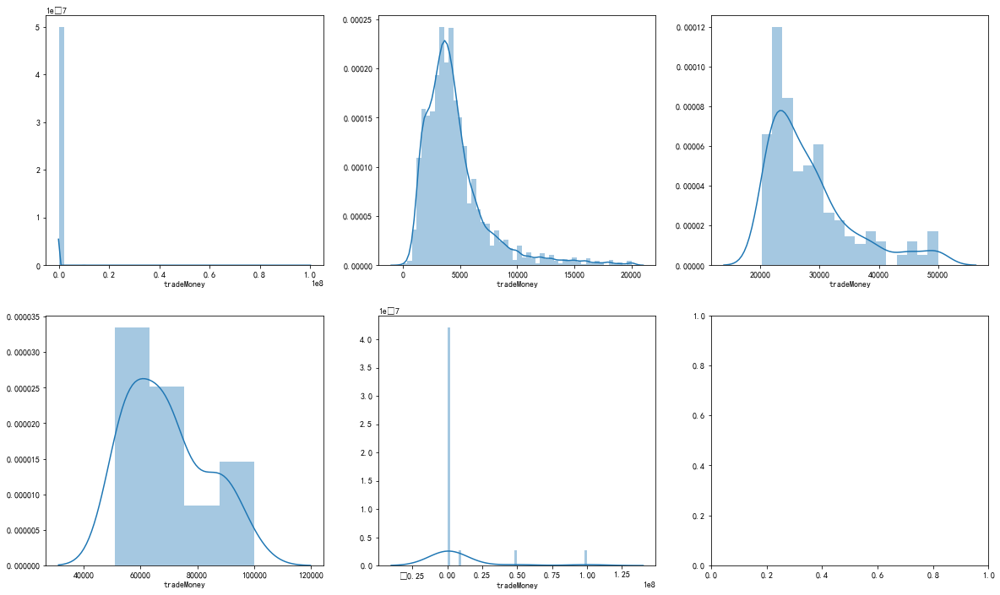


```python
# sns.distplot?
# sns.distplot(
#     ['a', 'bins=None', 'hist=True', 'kde=True', 'rug=False', 'fit=None', 'hist_kws=None', 'kde_kws=None', 'rug_kws=None', 'fit_kws=None', 'color=None', 'vertical=False', 'norm_hist=False', 'axlabel=None', 'label=None', 'ax=None'],
# )
```


```python
print("money<=10000",len(data_train[(data_train['tradeMoney']<=10000)]['tradeMoney']))
print("10000<money<=20000",len(data_train[(data_train['tradeMoney']>10000)&(data_train['tradeMoney']<=20000)]['tradeMoney']))
print("20000<money<=50000",len(data_train[(data_train['tradeMoney']>20000)&(data_train['tradeMoney']<=50000)]['tradeMoney']))
print("50000<money<=100000",len(data_train[(data_train['tradeMoney']>50000)&(data_train['tradeMoney']<=100000)]['tradeMoney']))
print("100000<money",len(data_train[(data_train['tradeMoney']>100000)]['tradeMoney']))
```

    money<=10000 38964
    10000<money<=20000 1985
    20000<money<=50000 433
    50000<money<=100000 39
    100000<money 19
    

# 不同的特征值的样本的label的分布


```python
plt.hist(data_train['totalFloor'],bins=10)
```


    (array([2.1741e+04, 1.0795e+04, 6.8350e+03, 1.7630e+03, 2.3600e+02,
            3.3000e+01, 3.0000e+01, 5.0000e+00, 0.0000e+00, 2.0000e+00]),
     array([ 0. ,  8.8, 17.6, 26.4, 35.2, 44. , 52.8, 61.6, 70.4, 79.2, 88. ]),
     <a list of 10 Patch objects>)


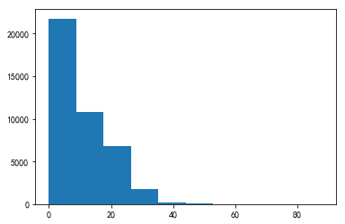


```python
floor=[data_train[(data_train['totalFloor']>i) & (data_train['totalFloor']<i+5)] for i in range(0,100,5)]
```


```python

```
